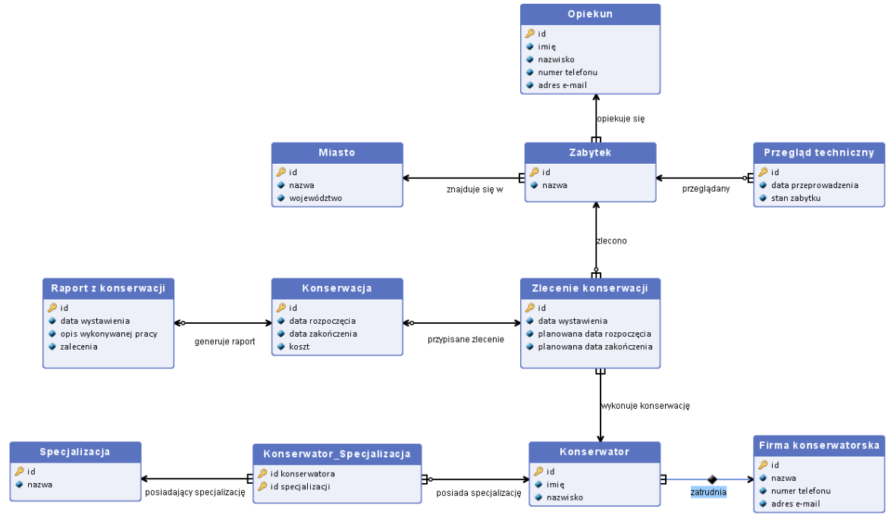

# Monuments Conservation Management System Database

## Note: SQL scripts, comments, and report (sprawozdanie.pdf) are in Polish.

SQL database system for managing historical monument conservation processes, including technical inspections, conservation orders, and maintenance reports. Developed as part of a Databases course at Gdańsk University of Technology.

## Author
- Karolina Glaza [GitHub](https://github.com/kequel)

## Features  
- **Comprehensive Database Schema**: 11 interrelated tables
- **Cascade Operations**: Automatic updates/deletes across related tables (demonstrated in `actualise_examples.sql`)
- **Queries**: SQL queries for planners, accountants and conservators
- **Data Integrity**: Constraints and checks for phone numbers, emails, and technical condition ratings

## Entity-Relationship Diagram

*Visual representation of tables and relationships between entities and supporting tables*

## Files  
| File | Description | 
|------|-------------|
| [`create_tables.sql`](create_tables.sql) | Complete database schema with constraints |
| [`insert.sql`](insert.sql) | Sample data for all tables |
| [`queries.sql`](queries.sql) | Queries with explanations |
| [`actualise_examples.sql`](actualise_examples.sql) | Cascade update demonstrations |
| [`delete_examples.sql`](delete_examples.sql) | Cascade delete demonstrations |
| [`sprawozdanie.pdf`](sprawozdanie.pdf) | Full documentation (entity descriptions, relationships) |
| [`diagram.png`](diagram.png) | Database schema diagram |

## Example Queries (queries.sql)
- Find conservators specialized in medieval art with ≥2 completed conservations
- Compare planned vs actual conservation completion dates
- Identify monuments in poor technical condition
- Calculate average conservation costs per firm
- Find conservation orders that missed deadlines
